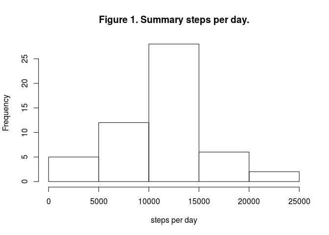
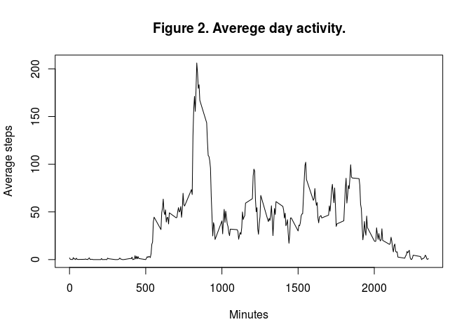
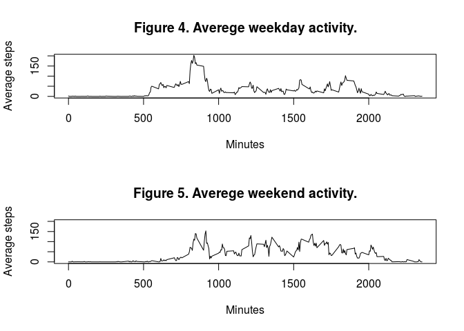

# Reproducible Research: Peer Assessment 1


## Loading and preprocessing the data

We assume that the data file is loaded and stored in the current directory.

```r
unzip("activity.zip","activity.csv")
activity<-read.csv("activity.csv")
```

Now we convert `activity$date` to Date class. Because `activity$date` is factor we convert it indirectly.

```r
activity$date<-as.Date(
  as.character(activity$date),
  format="%Y-%m-%d"
)
```

## What is mean total number of steps taken per day?

Now we summerazing total number steps per day and plot histogram. The aggregate function splited dataframe by
date and summarized steps into each split. Results are saved in `agg` dataframe.

```r
agg<-aggregate(steps ~ date, data=activity, sum)
hist(agg$steps, xlab = "steps per day", main="Figure 1. Summary steps per day.")
```

 

Mean steps per day is:

```r
mean(agg$steps)
```

```
## [1] 10766.19
```

Median steps per day is:

```r
median(agg$steps)
```

```
## [1] 10765
```

## What is the average daily activity pattern?

We calculate averege number of step per every 5-minutes interval for all days.

```r
typical_day<-aggregate(steps ~ interval, data=activity, mean)
plot(typical_day$interval,typical_day$steps, type="l", 
     main ="Figure 2. Averege day activity.", ylab ="Average steps", xlab = "Minutes" )
```

 

This 5-minute interval contains the maximum number of step:

```r
typical_day$interval[which.max(typical_day$steps)]
```

```
## [1] 835
```

## Imputing missing values

Now we calculate rows containing NA's:

```r
sum(is.na(activity))
```

```
## [1] 2304
```

Missing values are more 10% of all ones. It's quite a lot and can affect the outcome. Note that all the missing values are included to `activity$steps`.

```r
sum(is.na(activity$steps))
```

```
## [1] 2304
```

Now we replace NA values total median of steps. Processed data will save in `activity_filled`.

```r
activity_filled <- activity
activity_filled$steps[is.na(activity$steps)]<-median(activity$steps, na.rm = TRUE)
sum(is.na(activity_filled))
```

```
## [1] 0
```

And plot histogram with prossesed data:

```r
agg<-aggregate(steps ~ date, data=activity_filled, sum)
hist(agg$steps, xlab = "steps per day", main="Figure 3. Corrected summary steps per day.")
```

 

Also corrected mean steps per day is:

```r
mean(agg$steps)
```

```
## [1] 9354.23
```

And median:

```r
median(agg$steps)
```

```
## [1] 10395
```
Both values shifted to left. Perhaps this is due to NA values in the night hours.

## Are there differences in activity patterns between weekdays and weekends?

Now we creating factor indicating whether a given date is a weekday or weekend and separate days by this factor:

```r
Sys.setlocale("LC_TIME", "en_US.UTF-8")
```

```
## [1] "en_US.UTF-8"
```

```r
weekday <- weekdays(activity$date)
weekday <- ifelse(weekday == "Saturday" | weekday == "Sunday", "weekend", "weekday")
weekday <- factor(weekday)
typical_weekday<-aggregate(steps ~ interval, data=activity_filled[weekday=="weekday",], mean)
typical_weekend<-aggregate(steps ~ interval, data=activity_filled[weekday=="weekend",], mean)
```

And plot them:

```r
par(mfrow=c(2,1))
plot(typical_weekday$interval,typical_weekday$steps, type="l", 
     main ="Figure 4. Averege weekday activity.", ylab ="Average steps", xlab = "Minutes", ylim=c(0,200))
plot(typical_weekend$interval,typical_weekend$steps, type="l", 
     main ="Figure 5. Averege weekend activity.", ylab ="Average steps", xlab = "Minutes", ylim=c(0,200))
```

 
